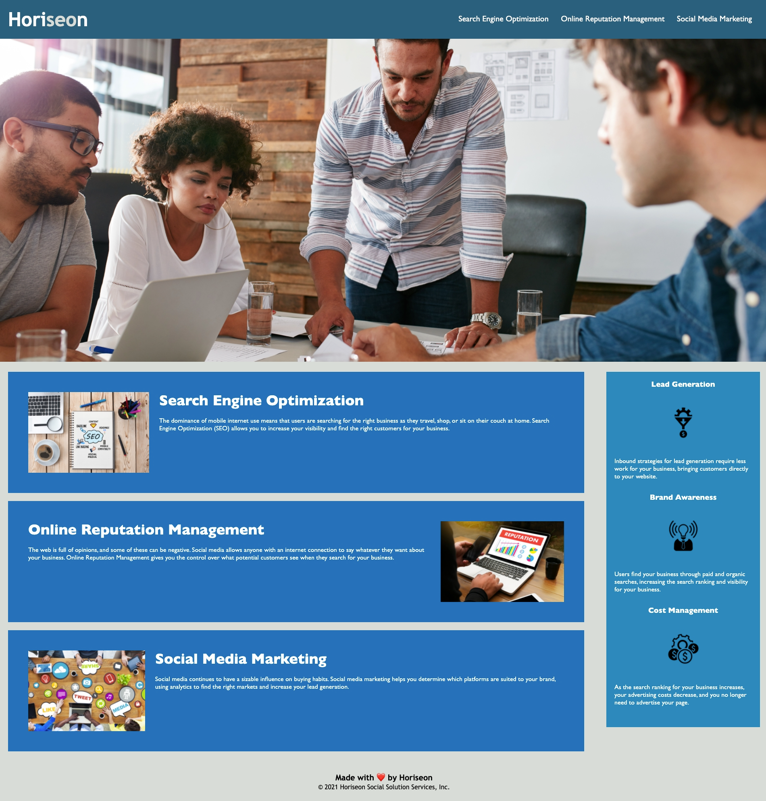

# horiseon-SEO-advancement
<h2>**Homework_01**</h2>

## What was your motivation?
- I really wanted to test myself in making the website more accessible because I know that in the real world, 
SEO and accesibility are problems that many businesses struggle to perfect or understand, and as someone who has SEO experience, my skills were great for this project
and I hope to continue.

## Why did I build this project?
- SEO is a huge part of marketing.
- If I could streamline the website so that web crawlers can navigate and prioritize websites with the most relevant data within the top ranks, 
then that would mean that cleaning up the html and css files was a huge success.

## What problem does it solve?
- This helps Horiseon SEO ranking and accesibility.
- Initially, they were using many 'div' tags to separate their sections and whatnot. Although this method works, it is not developer-friendly to look at. 
- For example, if the 'div' tags were kept, as consumers search the web for Horiseons website, it will take longer and be much harder for web crawlers to find the necessary data to rank on their search engine. 
- I wanted the website to be more accessible not only to developers, but the SEO work as well.
- I added a variety of semantic tags like 'main', 'section' and 'aside', and cleaned up the html and css files to make it more accessible.

## What did I learn?
- Because I already had prior exposure to SEO work, I enjoyed relearning making element attributes more accessible and easier to read and understand on the developer side. 
- What I genuinely enjoyed learning was simplifying the styling in the css. 
- Although it was a tedious task, looking at the files was so much easier, and definitely made it more accessible.

## Link to URL
https://dn-vanguard.github.io/horiseon-SEO-advancement/

## Screenshot

